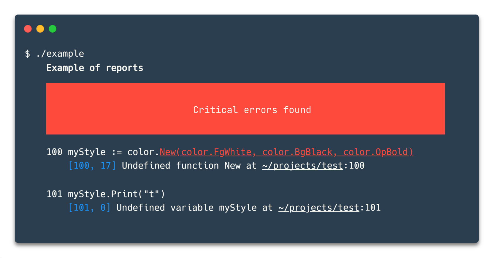

[](https://travis-ci.org/i582/cfmt) [](https://codecov.io/gh/i582/cfmt) [](https://goreportcard.com/report/github.com/i582/cfmt) [](https://raw.githubusercontent.com/i582/phpstats/master/LICENSE)  [](https://github.com/avelino/awesome-go)  

# cfmt

**cfmt** is a small library for **simple and convenient formatted stylized output** to the console, providing an interface that is exactly the same as the standard `fmt` library.

## Table of Contents

* [Install](#install)
* [Usage](#usage)
  * [Simple usage](#simple-usage)
  * [Complex style](#complex-style)
  * [Custom styles](#custom-styles)
  * [HEX colors](#hex-colors)
  * [Background color](#background-color)
* [Other examples](#other-examples)
* [Supported colors and styles](#supported-colors-and-styles)
* [Motivation](#motivation)
* [Contact](#contact)
* [License](#license)

## Install

```
go get -u -v github.com/i582/cfmt
```

## Usage

To switch to `cfmt` anywhere in the code, it is enough to add one letter `c` to `fmt` and you get all the possibilities, the library is fully compatible with the standard library `fmt`.

### Simple usage

Let's take an example:

Suppose you need to display text and highlight some word or phrase. Using `cfmt`, all that is needed is to wrap the desired part in `{{}}` and after `::` write the desired styles:

```go
cfmt.Println("This is a {{red color}}::red")
```


If we compare this with the `gookit/color` library, then this example looks more complicated and less readable there:

```go
fmt.Printf("This is a %s", color.Red.Sprintf("red color"))
```

### Complex style

It is even more convenient if you need complex styles, if you want to make the text also bold, then all you need to add is in the format after `|` write `bold`:

```go
cfmt.Println("This is a {{red color}}::red|bold")
```


In `gookit/color`, this is done as follows:

```go
redBold := color.New(color.FgRed, color.OpBold)
fmt.Printf("This is a %s", redBold.Sprintf("red color"))
```

### Custom styles

In the  `gookit/color` we can reuse the created style, in ` cfmt` this is also possible. To do this, you need to register a new style using the `cfmt.RegisterStyle` function:

```go
cfmt.RegisterStyle("code", func(s string) string {
	return cfmt.Sprintf("{{%s}}::red|underline", s)
})
```

And now it can be used anywhere just by writing its name:

```go
cfmt.Println("This is a {{red color}}::code")
```


The new style can of course also be used in conjunction with others:

```go
cfmt.Println("This is a {{red color}}::code|bold")
```


### HEX colors

If the standard colors are not enough for you, then you can use the colors in the Hex format (note, not all consoles support all colors fully!).

```go
cfmt.Println("This is a {{red color}}::#ff0000")
```

### Background color

To set the background color, you need to add the prefix `bg` to the color, in the case of standard colors, the first letter of the color must be capitalized:

```go
cfmt.Println("This is a {{red color}}::bgRed")
```

For HEX it will look like this:

```go
cfmt.Println("This is a {{red color}}::bg#ff0000")
```

## Other examples

```go
cfmt.RegisterStyle("code", func(s string) string {
	return cfmt.Sprintf("{{%s}}::red|underline", s)
})

cfmt.Printf(`
    {{Example of reports}}::bold

    {{                                                                            }}::bgRed
    {{                            Critical errors found                           }}::bgRed|#ffffff
    {{                                                                            }}::bgRed

    {{100}}::#ffffff myStyle := color.{{New(color.FgWhite, color.BgBlack, color.OpBold)}}::code|bold
        {{[100, 17]}}::blue Undefined function New at {{~/projects/test}}::underline:100

    {{101}}::#ffffff {{myStyle}}::code.Print("t")
        {{[101, 0]}}::blue Undefined variable myStyle at {{~/projects/test}}::underline:101
`)
```



```go
cfmt.Print(`
        {{                 -/+:.          }}::green
        {{                :++++.          }}::green
        {{               /+++/.           }}::green
        {{       .:-::- .+/:-''.::-       }}::green
        {{    .:/++++++/::::/++++++//:    }}::green
        {{  .:///////////////////////:    }}::yellow
        {{  ////////////////////////      }}::yellow
        {{ -+++++++++++++++++++++++       }}::red
        {{ /++++++++++++++++++++++/       }}::red
        {{ /sssssssssssssssssssssss.      }}::red
        {{ :ssssssssssssssssssssssss-     }}::red
        {{  osssssssssssssssssssssssso/   }}::magenta
        {{   syyyyyyyyyyyyyyyyyyyyyyyy+   }}::magenta
        {{    ossssssssssssssssssssss/    }}::blue
        {{      :ooooooooooooooooooo+.    }}::blue
        {{       :+oo+/:-..-:/+o+/-       }}::blue
`)
```


## Supported colors and styles

| Styles                                                 |
| ------------------------------------------------------ |
| *italic*                                               |
| **bold**                                               |
| ~~crossout~~                                           |
| <ins>underline</ins>                                   |
| <span style="text-decoration:overline">overline</span> |
|faint|
|reverse|
|blink|


| Colors  |              |               |           |
| ------- | ------------ | ------------- | --------- |
| black   | darkGray     | bgDarkGray    | bgBlack   |
| red     | lightRed     | bgLightRed    | bgRed     |
| green   | lightGreen   | bgLightGreen  | bgGreen   |
| yellow  | lightYellow  | bgLightYellow | bgYellow  |
| blue    | lightBlue    | bgLightBlue   | bgBlue    |
| magenta | lightMagenta | bgLightMagent | bgMagenta |
| cyan    | lightCyan    | bgLightCyan   | bgCyan    |
| white   | lightWhite   | bgLightWhite  | bgWhite   |
| gray    |              |               | bgGray    |

And colors in HEX format. See [HEX colors](#hex-colors) part.

## Motivation

The existing libraries for styling output are very powerful, and this library is built on two of them (gookit/color and muesli/termenv). However, they are not very convenient to use for styling specific words or sentences, since you need to use `Sprintf` and put the stylized into a format string, which greatly reduces readability if you need to style many elements.

I believe that the library will be useful primarily for formatting ready-made text, for reference or examples. However, in other cases it should be just as convenient.

The library aims to make formatted text look readable in code, even with complex formatting.

## Contact

 For any questions — tg: `@petr_makhnev`.

## License

This project is under the **MIT License**. See the [LICENSE](https://github.com/i582/phpstats/blob/master/LICENSE) file for the full license text.
